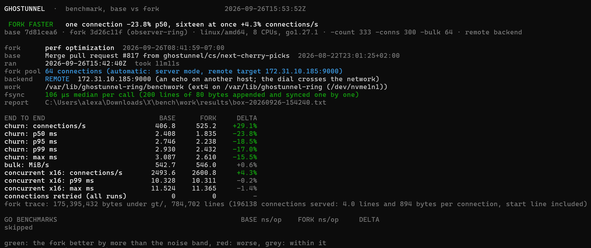
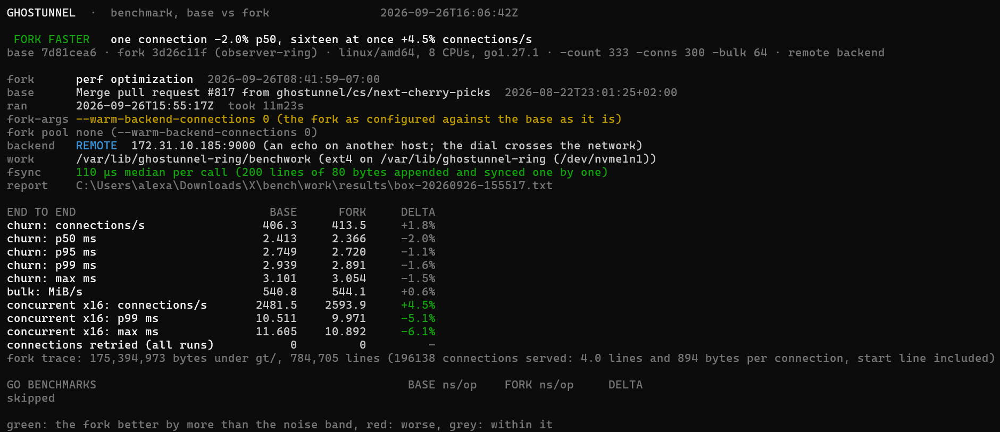

A ghostunnel that never serves unobserved
=========================================

A fork of [Ghostunnel](https://github.com/ghostunnel/ghostunnel) with an
observer ring attached. The proxy is upstream's, and upstream's
README follows this introduction. What the fork adds is a rule the code
enforces on every connection: ghostunnel serves only while four separate
programs, watching its trace and each other, find nothing wrong.

What it costs
-------------

Every served connection writes its record to disk and waits for the sync
before a byte is forwarded, and the proxy asks the gate on every accept. The
benchmark under `bench/` measures what that costs against upstream ghostunnel
at the same commit, both proxies driven by the same client against the same
echo on another host, 333 rounds of 300 connections each.

With the warm backend pool the fork keeps by default, the record's sync
overlaps the backend dial and the fork comes out ahead on every line:

With the pool off (`--warm-backend-connections 0`), the fork pays its sync in
full and still holds level with base:

`bench/README.md` says how to run it and what the host needs.

The fork in one page
--------------------

**The proxy leaves a trace.** Under `gt/` (`--ring-traces`) ghostunnel
appends one JSON line per event: its start line with the configuration it
serves, every accept, every handshake with its outcome, every access
decision with the rule that decided it, every close with its reason, every
reload, every shutdown request, every failed accept, every refusal, and a
tick every five seconds so a quiet proxy and a dead one leave different
traces. The trace is append-only, strictly formatted, and durable before
any byte of a connection is forwarded. Beside it two content-addressed
stores keep what the lines name: `gt/chains/` holds every certificate chain
a peer presented, and `gt/material/` every CA bundle the proxy verified
against, each under the SHA-256 of its bytes (`ringtrace/README.md`).

**Four observers watch it, and each other.** `observers/tunnel` judges the
data path (the listener, verification on every handshake, the access
decisions, the lifetime cap), `observers/admin` the status surface,
`observers/material` the trust material and its reload, and
`observers/super`, the coordinator, nothing of its own: it holds copies of
the other three and reads the trace as they do. Each runs as its own user
and owns a store of files: a chained heartbeat every cycle, a `fault` while
one of its own checks fails, a `halt` when anything fails, and a copy of a
peer's heartbeat that the peer's store must match. Every member reads
every other member's store every cycle, roughly three times a second
(`observers/README.md`, `observers/SPEC.md`).

**The proxy consults a gate on every accept.** Before a connection is
served, ghostunnel reads the store tree: a `halt` or `fault` in any store,
a delivered halt in any `halts/`, or a coordinator heartbeat that is
missing, malformed, stopped, or more than `--ring-heartbeat-max-age` from
its clock in either direction refuses the connection. The read happens on
every accept, from a standing decision refreshed on every change the
kernel reports and by a full scan every second (`ringtrace/README.md`,
section 3).

**Halt on any fault, recovery by unanimity.** A member whose check fails
writes a halt in its own store and a slot in every other member's `halts/`;
the others relay it. The proxy refuses new connections at once and closes
the ones in flight within a second, each with a `close` of reason `halt`.
Nothing lifts until the failing member's check passes and it clears its
fault, the coordinator sees no fault at any root and stands down, and every
member follows. Then the proxy serves again on the next accept, with no
restart and no dwell.

**Five users, one writer per path.** The deployment is five systemd units
on one Linux host: `gt` for the proxy and one `gtobs-*` user per member.
Directory ownership, the sticky bit on shared `halts/` directories, and
each unit's `ReadWritePaths=` give every path in the tree exactly one
writer. The proxy can write its trace and nothing else; a member can write
its own store, one peer's copy, and one slot in each other member's
`halts/`; nobody can remove a halt they did not write (`deploy/README.md`).

What it gives a developer
-------------------------

- **A trace you can read and diff.** Every accept, handshake, access
  decision, close, reload, shutdown request, failed accept and refusal is
  one line, in sequence, with exact keys and closed vocabularies. `go test`
  fixtures and a deployment's `gt/` read the same way.
- **Four small programs and an oracle.** The observers are four packages
  with one structural core, judged against 92 fixtures under
  `observers/testdata/fixtures`: snapshots of a store tree with the
  verdicts, failing checks, halt, publication, relay and clears a member
  must produce over them. They run without a proxy, without a ring and
  without the network (`observers/testdata/FIXTURES.md`).
- **Re-verification from bytes.** The members do not take the proxy's word
  for a handshake or an access decision. For every served connection they
  read the presented chain from `gt/chains/`, verify it against the CA
  bundle from `gt/material/` under the hash the start line or the last
  reload recorded, and re-run the recorded rule set on the leaf, OPA policy
  included. A change to the verifier that lets the wrong peer through halts
  the ring: in tests, through the differential test that holds each
  member's mirror to the proxy's verifier, and in production, through
  `acl-substance` on the live trace.
- **`ringstatus`.** `observers/ringstatus` prints the ring as it stands:
  the verdict, each member's state and cadence, who has read whom, the
  copies, and any delivered halt. It reads the stores and writes nothing
  (`observers/ringstatus/README.md`).
- **A benchmark tool.** `bench/` measures what the ring costs the proxy per
  connection, with and without the trace and the gate on the accept path,
  against the same backend; `bench/README.md` says how to run it and how to
  read what it prints.

What the ring guarantees, and what enforces it
----------------------------------------------

Stated only as far as the code enforces them. The threat model
(`docs/security/threat-model.md`) states each guarantee with the line that
enforces it, the residual issues that hold in this tree, and the limits the
ring declares.

- **The proxy serves only while the coordinator's heartbeat is fresh and no
  halt exists in any store.** `ringtrace.Gate.Check` reads every member's
  `halt`, `fault` and `halts/` and the coordinator's newest heartbeat, and
  refuses on the first failure; `ring.Accepted` calls it on every accept
  through a `GateState` whose standing decision is dropped on any change the
  kernel reports on the tree, and re-scanned every second regardless
  (`ring.watch`). A serve decision is never reused past the heartbeat's
  window: its age is judged by the clock on every reuse.
- **A fault at any member stops the proxy within that member's cycle plus
  the watch interval.** The member writes its halt and slots at the end of
  the cycle that found the fault (SPEC 12.1); the next accept sees the slot
  (the watcher reports the write) and the watch's next scan, at most a
  second later, closes every connection in flight (`proxy.CloseAll`).
- **Recovery needs every member's fault gone and the coordinator's
  stand-down.** A member removes its own slots and halt only when no store
  holds a `fault` and the coordinator's own `halt` is gone; the coordinator
  removes its only when no store holds a `fault` and none of its own checks
  failed (SPEC 12.3, `decideHalts`). The gate reads `fault` as well as
  `halt`, so a fault stops serving before the halt it will become is even
  written.
- **Every served connection's chain is re-verified against the CA bundle as
  stored under its hash, and the access rule re-run.** `handshake-substance`
  and `acl-substance` in every member read the chain by its hash, refuse a
  file whose bytes do not hash to its name, read the bundle in force at the
  line by the recorded hash and never by its path, and compare the member's
  own decision and rule with the recorded ones; a disagreement halts (SPEC
  14.3).
- **The trace is read by content and never trusted by size.** Segments are
  pre-extended to their maximum size, so a segment's length says nothing;
  every reader takes a segment's content as its bytes before the first NUL,
  in bounded chunks, and `trace-consistent` remembers the hash of the
  prefix it read and halts if that prefix changes, shrinks or vanishes
  (SPEC 14, `ringtrace/README.md` 1.3).
- **A member that cannot answer has not passed.** An unreadable store, a
  heartbeat that will not parse, a chain that will not verify, a trace that
  cannot be read, a process table that cannot be seen: each fails the check
  that needed it, and the failure halts (SPEC 11.3, 14.3).

What the ring does not do
-------------------------

It runs on one host. Every member, the proxy and the stores share one
kernel and one service manager, and whoever holds the host holds all of
them. It cannot stop a proxy rewritten not to consult the gate; it detects
one, because the connections such a proxy serves are in a trace every
member re-verifies, and a proxy whose trace stops is one every member
reports. It does not establish which build was intended, that a store
bearing a member's name was meant to be that member, or anything about its
own code (SPEC 20).

Where to read next
------------------

- `observers/README.md`: the four members, what each watches, the stores,
  faults, halts, recovery, and how to run the tests.
- `observers/SPEC.md`: the normative specification the members implement.
- `ringtrace/README.md`: the trace format, the two stores, the emitter and
  the gate.
- `deploy/README.md`: the tree, the users, the units, and what to do when
  the ring halts.

Upstream's README follows.

Ghostunnel
==========

    

👻

Ghostunnel is a simple TLS proxy with mutual authentication support for
securing non-TLS backend applications.

Ghostunnel supports two modes, client mode and server mode. Ghostunnel in
server mode runs in front of a backend server and accepts TLS-secured
connections, which are then proxied to the (insecure) backend. A backend can be
a TCP host/port or a UNIX domain socket. Ghostunnel in client mode accepts
(insecure) connections through a TCP or UNIX domain socket and proxies them to
a TLS-secured service.

**Supported platforms**: Ghostunnel is developed & tested on Linux, macOS,
and Windows but also runs on most other UNIX systems that are supported
by Go such as FreeBSD, OpenBSD, and NetBSD.

Key Features
============

**[Authentication & Authorization](#access-control-flags)**: Enforces mutual
TLS authentication by requiring valid client certificates. Supports
fine-grained access control checks on certificate fields (CN, OU, DNS/URI
SAN), and declarative authorization policies via [Open Policy
Agent](https://www.openpolicyagent.org) (OPA).

**[Certificate Hotswapping](#certificate-hotswapping)**: Reload certificates
without restarting via SIGHUP/SIGUSR1 or timed reload intervals, enabling use
of short-lived certificates.

**[Flexible Certificate Sources](#certificates)**: Load certificates and keys
from PEM/PKCS#12 files, ACME (Let's Encrypt), hardware security modules
(PKCS#11), macOS Keychain, Windows Certificate Store, or the SPIFFE Workload
API.

**[Secure by Default](#landlock-support)**: Listeners and targets are
restricted to localhost and UNIX sockets unless explicitly overridden with
`--unsafe-listen` or `--unsafe-target`, preventing accidental exposure. On
Linux, Landlock sandboxing is enabled by default to limit process privileges.

**[Metrics & Profiling](#metrics--profiling)**: Built-in status port with JSON
and Prometheus metrics endpoints, plus optional pprof profiling.

Ghostunnel also supports UNIX domain sockets, PROXY protocol v2,
systemd/launchd socket activation, Windows service management (SCM), and more.

Getting Started
===============

To get started and play around with Ghostunnel you will need X.509 client
and server certificates. If you already maintain a PKI, you can use your
existing certificates. Otherwise, you can use tools like
[mkcert](https://github.com/FiloSottile/mkcert) or
[cloudflare/cfssl](https://github.com/cloudflare/cfssl) to build one.

For quick testing and development, you can also generate throwaway test
certificates using the built-in generator:

    # Generate test certificates and keys
    go tool mage test:keys

This will create a `test-keys` directory with all the necessary certificates and keys
for testing. **Note: These are test certificates only and should NOT be used in production.**

### Install

Ghostunnel is available through [GitHub releases][rel] and through [Docker Hub][hub].

Please note that the official release binaries are best-effort, and are usually
built directly via GitHub Actions on the latest available images. If you need
compatibility for specific OS versions we recommend building yourself.

Ghostunnel uses the [mage][mage] build system, a make/rake-like build tool using
Go. Mage is available as a Go tool dependency (no separate install needed). You
can build Ghostunnel with the commands shown below.

    # Compile binary
    go tool mage go:build

    # Build containers
    go tool mage docker:build

You can also run `go tool mage -l` to view all build targets and add `-v` to
mage commands to get more verbose output.

[rel]: https://github.com/ghostunnel/ghostunnel/releases
[hub]: https://hub.docker.com/r/ghostunnel/ghostunnel
[mage]: https://magefile.org

### Develop

Ghostunnel has an extensive suite of integration tests. Our integration test
suite requires Python 3.

To run tests:

    # Option 1: run unit & integration tests locally
    go tool mage test:all

    # Option 2: run unit & integration tests in a Docker container
    # This also runs PKCS#11 integration tests using SoftHSM in the container
    go tool mage test:docker

    # Open coverage information in browser
    go tool cover -html coverage/all.profile

For more information on how to contribute, please see the [CONTRIBUTING](CONTRIBUTING.md) file.

Usage
=====

To see available commands and flags, run `ghostunnel --help`. You can get more
information about a command by adding `--help` to the command, like `ghostunnel
server --help` or `ghostunnel client --help`. Man pages are also available for
[Linux](docs/reference/manpage-linux.md) and [macOS](docs/reference/manpage-darwin.md).

By default, Ghostunnel runs in the foreground and logs to stdout. You can set
`--syslog` to log to syslog instead of stdout. If you want to run Ghostunnel
in the background, we recommend using a service manager.

### Certificates

Ghostunnel accepts certificates in multiple different file formats.

The `--keystore` flag can take a PKCS#12 keystore or a combined PEM file with the
certificate chain and private key as input (format is auto-detected). JCEKS/JKS
keystores are also supported for legacy use cases. The `--cert` / `--key` flags can
be used to load a certificate chain and key from separate PEM files (instead of a
combined one).

Ghostunnel also supports loading identities from the macOS keychain or the
SPIFFE Workload API and having private keys backed by PKCS#11 modules, see the
"Advanced Features" section below for more information.

### Server mode

This is an example for how to launch Ghostunnel in server mode, listening for
incoming TLS connections on `localhost:8443` and forwarding them to
`localhost:8080`. Note that while we use TCP sockets on `localhost` in this
example, both the listen and target flags can also accept paths to UNIX domain
sockets as their argument.

To set allowed clients, you must specify at least one of `--allow-all`,
`--allow-cn`, `--allow-ou`, `--allow-dns`, `--allow-uri`, or `--allow-policy`. All
checks are made against the certificate of the client. Multiple flags are
treated as a logical disjunction (OR), meaning clients can connect as long as
any of the flags matches. Alternatively, `--allow-spki-pin` authenticates clients by
out-of-band SPKI key pinning. See [ACCESS-FLAGS](docs/security/access-flags.md)
for more information. In this example, we assume that the CN of the client cert we want
to accept connections from is `client`.

**Note:** Before running the examples below, make sure you have generated the test
certificates by running `go tool mage test:keys` (see the [Getting Started](#getting-started)
section above).

Start a backend server:

    nc -l localhost 8080

Start a Ghostunnel in server mode to proxy connections:

    ghostunnel server \
        --listen localhost:8443 \
        --target localhost:8080 \
        --keystore test-keys/server-keystore.p12 \
        --cacert test-keys/cacert.pem \
        --allow-cn client

Verify that clients can connect with their client certificate:

    openssl s_client \
        -connect localhost:8443 \
        -cert test-keys/client-combined.pem \
        -key test-keys/client-combined.pem \
        -CAfile test-keys/cacert.pem

Now we have a TLS proxy running for our backend service. We terminate TLS in
Ghostunnel and forward the connections to the insecure backend.

### Client mode

This is an example for how to launch Ghostunnel in client mode, listening on
`localhost:8080` and proxying requests to a TLS server on `localhost:8443`.

By default, Ghostunnel in client mode verifies targets based on the hostname.
Various access control flags exist to perform additional verification on top of
the regular hostname verification. See [ACCESS-FLAGS](docs/security/access-flags.md) for
more information.

Start a backend TLS server:

    openssl s_server \
        -accept 8443 \
        -cert test-keys/server-combined.pem \
        -key test-keys/server-combined.pem \
        -CAfile test-keys/cacert.pem

Start a Ghostunnel with a client certificate to forward connections:

    ghostunnel client \
        --listen localhost:8080 \
        --target localhost:8443 \
        --keystore test-keys/client-combined.pem \
        --cacert test-keys/cacert.pem

Verify that we can connect to `8080`:

    nc -v localhost 8080

Now we have a TLS proxy running for our client. We take insecure local
connections, wrap them in TLS, and forward them to the secure backend.

### Full tunnel (client plus server)

We can combine the above two examples to get a full tunnel. Note that you can
start the tunnels in either order.

Start netcat on port `8001`:

    nc -l localhost 8001

Start the Ghostunnel server:

    ghostunnel server \
        --listen localhost:8002 \
        --target localhost:8001 \
        --keystore test-keys/server-combined.pem \
        --cacert test-keys/cacert.pem \
        --allow-cn client

Start the Ghostunnel client:

    ghostunnel client \
        --listen localhost:8003 \
        --target localhost:8002 \
        --keystore test-keys/client-keystore.p12 \
        --cacert test-keys/cacert.pem

Verify that we can connect to `8003`:

    nc -v localhost 8003

Now we have a full tunnel running. We take insecure client connections,
forward them to the server side of the tunnel via TLS, and finally terminate
and proxy the connection to the insecure backend.

Docker Images
=============

Docker images are published to [Docker Hub][hub] on each release. Three
variants are available:

| Image | Tag |
|-------|-----|
| Alpine | `ghostunnel/ghostunnel:latest-alpine`, `ghostunnel/ghostunnel:v1.x.x-alpine` |
| Debian | `ghostunnel/ghostunnel:latest-debian`, `ghostunnel/ghostunnel:v1.x.x-debian` |
| Distroless | `ghostunnel/ghostunnel:latest-distroless`, `ghostunnel/ghostunnel:v1.x.x-distroless` |

The `latest` tags always point to the most recent release. The bare
`ghostunnel/ghostunnel:latest` and `ghostunnel/ghostunnel:v1.x.x` tags are
aliases for the Alpine variant.

See [DOCKER](docs/deployment/docker.md) for details.

Advanced Features
=================

### Access Control Flags

Ghostunnel supports different types of access control flags in both client and
server modes to enforce authorization checks. Ghostunnel can check various
attributes of peer certificates directly, including a SPIFFE ID from a peer
using a [SPIFFE][spiffe] [X.509 SVIDs][svid]. In addition to this, Ghostunnel
also supports implementing authorization checks via [Open Policy Agent](https://www.openpolicyagent.org/)
(OPA) policies for maximum flexibility. Policies can be reloaded at runtime
much like certificates.

See [ACCESS-FLAGS](docs/security/access-flags.md) for details.

[spiffe]: https://spiffe.io/
[svid]: https://github.com/spiffe/spiffe/blob/main/standards/X509-SVID.md

### Logging Options

You can silence specific types of log messages using the `--quiet=...` flag,
such as `--quiet=conns` or `--quiet=handshake-errs`. You can pass this flag
repeatedly if you want to silence multiple different kinds of log messages.

Supported values are:
* `all`: silences **all** log messages
* `conns`: silences log messages about new and closed connections.
* `conn-errs`: silences log messages about connection errors encountered (post handshake).
* `handshake-errs`: silences log messages about failed handshakes.

In particular we recommend setting `--quiet=handshake-errs` if you are
running TCP health checks in Kubernetes on the listening port, and you
want to avoid seeing error messages from aborted connections on each health
check.

### Certificate Hotswapping

To trigger a reload, simply send `SIGHUP` (or `SIGUSR1`) to the process or set a time-based
reloading interval with the `--timed-reload` flag. This will cause Ghostunnel
to reload the certificate, private key, and CA bundle from the files on disk
(as well as OPA policy bundles, if configured). Once successful, the reloaded
certificate will be used for new connections going forward.

Additionally, Ghostunnel uses `SO_REUSEPORT` to bind the listening socket on
platforms where it is supported (Linux, macOS, FreeBSD, NetBSD, OpenBSD, and
DragonFly BSD). This means a new Ghostunnel can be started on the same host/port
before the old one is terminated, to minimize dropped connections (or avoid
them entirely depending on how the OS implements the `SO_REUSEPORT` feature).

Note that if you are using an HSM/PKCS#11 module, only the certificate will
be reloaded. It is assumed that the private key in the HSM remains the same.
This means the updated/reissued certificate must match the private key that
was loaded from the HSM previously, everything else works the same.

See [RELOADING](docs/certificates/reloading.md) for details.

### ACME Support

Ghostunnel in server mode supports the ACME protocol for automatically
obtaining and renewing a public certificate, assuming it's exposed publicly
on tcp/443 and there are valid public DNS FQDN records that resolve to the
listening interface IP.

See [ACME](docs/certificates/acme.md) for details.

### Metrics & Profiling

Ghostunnel has a notion of "status port", a TCP port (or UNIX socket) that can
be used to expose status and metrics information over HTTPS. The status port
feature can be controlled via the `--status` flag. Profiling endpoints on the
status port can be enabled with `--enable-pprof`.

See [METRICS](docs/networking/metrics.md) for details.

### HSM/PKCS#11 support

Ghostunnel has support for loading private keys from PKCS#11 modules, which
should work with any hardware security module that exposes a PKCS#11 interface,
including YubiKeys (via the YKCS11 module).

See [HSM-PKCS11](docs/certificates/hsm-pkcs11.md) for details, including a step-by-step
guide for using Ghostunnel with a YubiKey.

### Windows/macOS Keychain Support

Ghostunnel supports loading certificates from the Windows and macOS keychains.
This is useful if you have identities stored in your local keychain that you
want to use with Ghostunnel, e.g. if you want your private key(s) to be backed
by the Secure Enclave on newer Touch ID MacBooks.

See [KEYCHAIN](docs/certificates/keychain.md) for details.

### SPIFFE Workload API

Ghostunnel has support for maintaining up-to-date, frequently rotated
identities and trusted CA certificates from the SPIFFE Workload API.

See [SPIFFE-WORKLOAD-API](docs/certificates/spiffe-workload-api.md) for details.

### Socket Activation

Ghostunnel supports socket activation via both systemd (on Linux) and launchd
(on macOS). Socket activation is supported for the `--listen` and `--status`
flags, and can be used by passing an address of the form `systemd:<name>` or
`launchd:<name>`, where `<name>` should be the name of the socket as defined in
your systemd/launchd configuration.

See [SYSTEMD](docs/deployment/systemd.md) and [LAUNCHD](docs/deployment/launchd.md)
for examples.

### PROXY Protocol Support

Ghostunnel in server mode supports signaling of transport connection information
to the backend using the [PROXY protocol](https://www.haproxy.org/download/3.1/doc/proxy-protocol.txt)
(v2), just pass the `--proxy-protocol` flag on startup. Use `--proxy-protocol-mode`
to also include TLS metadata and/or client certificate details. Note that the
backend must support the PROXY protocol and must be configured to use it when
setting this option.

See [PROXY-PROTOCOL](docs/networking/proxy-protocol.md) for details on modes and TLV extensions.

### Landlock Support

Ghostunnel can use [Landlock](https://landlock.io) to limit process privileges
on Linux. Landlock is enabled by default in best-effort mode and can be
disabled using `--disable-landlock` if necessary (not recommended). When
enabled, Ghostunnel will limit its access to files and sockets based on the
flags passed at startup. Note that Landlock does not work with PKCS#11 modules
and is disabled if PKCS#11 is used (as PKCS#11 modules are opaque to us we
can't craft workable Landlock rules for them).
